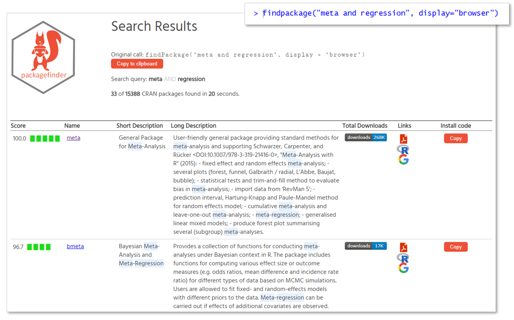
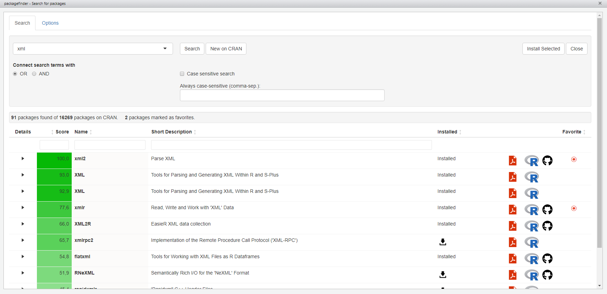
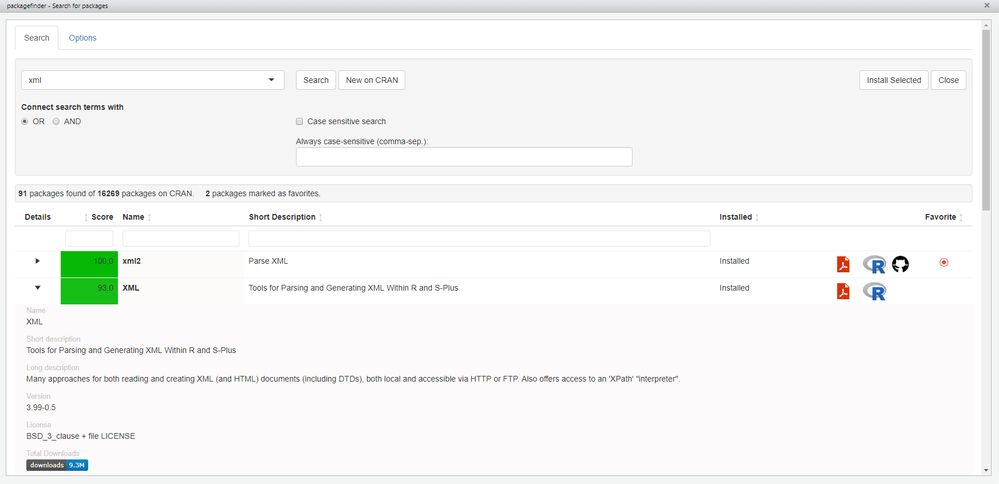

# packagefinder - A brief introduction


# For those in a hurry: packagefinder in one minute
* *packagefinder* is made to search for packages on CRAN.
* Install it with ````install.packages("packagefinder", dependencies = TRUE)````.
* Use the ````findPackage()```` function (or its shortcut ````fp()````) to search for packages o CRAN.
* Assume, you want to search packages with the search terms ````"meta"```` and ````"regression"```` in their name, title or description; then you can query CRAN with ````findPackage```` like this: ````findPackage(c("meta", "regression"), mode = "and")````.
* Alternatively, you can phrase your query simply as ````findPackage("meta and regression")````.
* Results can be displayed in the console (argument ````display = "console"````), the viewer (````display = "console"````, if you are using R Studio), or your web browser (````display = "browser"````), my favorite. So, ````fp("meta and regression", display = "browser")```` is all you need to to search CRAN for all packages relevant for meta regression and show the results as a webpage.
* Apart from ````findPackage()````, *packagefinder* provides even more features to learn about packages: Use ````whatsNew()```` to find out what's new on CRAN; if you want to learn more on a specific package, query it with ````packageDetails() ````, e.g. ````packageDetails("ggplot2")```` to find out more.
* `packagefinder` comes with an add-in for RStudio that allows you to use the `packagefinder` functionality through a graphical interface.
* Check the *packagefinder* [cheat sheet](http://www.zuckarelli.de/packagefinder/packagefinder_cheatsheet.pdf)


# A bit more into the details: What is packagefinder? How does it benefit me?

Currently, there are more than 16,000 R package contributions on CRAN providing R with an unparalleled wealth of features. The downside of the large and increasing amount of packages is that it becomes increasingly difficult to find the right tools to tackle a specific problem. Unfortunately, CRAN itself does not provide any good search functionality.

*packagefinder* is designed to search for CRAN packages right from the R console. The philosophy behind this package is that R users like using the R console and need a tool to do their day-to-day-work on CRAN without leaving their normal workspace, the console. In fact, the idea is that with *packagefinder* you do not *need* to leave the R console to work with CRAN effectively. 

*packagefinder* is developed to save you time and energy finding the right packages to work with, thereby making your work with R more productive.


# Working with packagefinder: Search indices

*packagefinder* works with a CRAN search index. Most *packagefinder* functions have an optional ````index```` argument that allows you to provide a search index. 

If you do not want to provide you own index, you can let *packagefinder* build a search index for you on-the-fly. This procedure is quick and does the trick, so you do not really have to care for the search index at all. 

This search index, however, will not include download figures. If you want download figures to be included in the search results, you need to build a search index yourself by calling the ````buildIndex()```` function, for example like this:

````
buildIndex(filename = "myindex.rdata", download.stats = TRUE)
````

````buildIndex()```` not only returns the search index so that you can immediately work with it but it also able to save the index to a file, depending on the optional ````filename```` argument.

Please note that building a search index with download stats included can take some time (an hour or so) because download figures are requested for each of the several thousand R packages individually. A progress bar informs you about the current state of things while your index is being built.


# Searching CRAN for packages

## Using ````findPackage()````

### The basics
It is easy to search for packages on CRAN with ````findPackage()````. Its main arguments are a vector of keywords you are looking for, ````keywords````, and the search mode, ````mode````. The mode determines if your keywords will be linked together with AND or OR (default is ````"OR"````).

So, a simple search for all packages covering meta regression topics, for example, may look like this:

````
findPackage(c("meta", "regression"), "and")
````

Alternatively you can also simply execute:
````
findPackage("meta and regression")
````
or 
````
findPackage("meta AND regression")
````
in the console (the logical operators are not case-sensitive). If you write a query like this, the ````keywords```` argument is ignored. Currently, the first logical operator is used for all 'sub-queries', so  
````
findPackage(c("meta AND regression", "model OR heterogeneity"))
````
in fact searches for ````meta AND regression AND model and heterogeneity````. This behavior may change in future versions of *packagefinder*.


### A bit more advanced search

With the ````case.sensitive```` argument (default: ````FALSE````) you can change your search from case insensitive (i.e., ignoring capitalization) to **case sensitive**.

If you are working with case insensitive search you may still want some terms, especially abbreviations, to be considered case sensitive; for example, "SEM" (structural equation model) is part of many other words, too, like seminar, semantics, semi. To really find only SEM-related packages, you need to make sure this term is considered a case-insensitive search term even if all other search terms are not (i.e., ````case.sensitive=FALSE````). To accomplish this, you can pass a vector of terms that are always considered case sensitive to ````findPackage```` using the ````always.sensitive```` argument.

Using the ````weights```` argument, you can change the **weights** put on matches of your search terms in the package name, short description and long description of the package. These three are the fields that ````findPackage()```` searches your keywords in (if you want to have other fields looked into, as well, you should consider using the ````exploreFields()```` function). The fourth element of the weighting schemes is a factor applied to the search score if all terms are indeed found; this fourth element is therefore only interesting when you work in OR mode. The default weighting scheme is ````c(1,2,1,2)````, that means matches in the short description receive double weight compared to matches in the package name or long description, and the search score is doubled if all terms are found in OR mode.

The ````display```` argument lets you decide **how** you want your **search results be displayed**. You can choose to view them in the ````console````, in the ````viewer```` (if you are using R Studio) or as a special results page in the web ````browser````. The default value is ````viewer````. Anyway, give ````browser```` a try and see if you like it. One of the advantages of the browser version of the results is that you find direct links to the package documentation and can copy the R code to install a package easily. Also, the download figures of the packages are presented on the results page per default.  



There are two more arguments influencing the display of the results: With ````limit.results```` you can determine the **number of results** being displayed (default value is ````15````); if you want to have *all*  matches be displayed, use a negative value for ````limit.results````. With ````results.longdesc```` (default value is ````FALSE````) you can decide to **include the packages' long descriptions** in the search results; given display space limitations, this may make the whole search results a bit less readable.

If you choose ````browser```` as the option for the ````display```` argument to view the results in your web browser, the long descriptions are always included in the search results and *all* matching packages are presented, not just ````limit.results```` packages. 


## Using ````exploreFields()````

While ````findPackage```` only looks into the packages' names, short and long descriptions, the experimental function ````exploreFields```` allows you to search in all important fields including, authors, imports, depends, enhances, license and many more.

To accomplish this, ````exploreFields()```` takes not only a search term (only one at this time, no length>1 vector!) but also a vector of fields in which to look for the search term (````fields````). The default is ````fields=c("Name", "Description", "LongDescription")```` representing the package name, short and long descriptions, the fields also employed by ````findPackage()````.

The ````mode```` argument (AND, OR) works differently than with ````findPackage()````. Since there is only one search term here, the AND and OR are related to the fields you are looking into. So, if ````mode="AND"```` then the search term must be found in *all* fields specified in the ````fields```` argument.

Finally, the ````match```` argument determines if a match must be ````"exact"```` (field content matches search term exactly) or if a match only needs to include the search term (````"like"````).

Search with ````exploreFields```` is always case-sensitive.

To find packages where Hadley Wickham was somehow involved we could search like this:

````
exploreFields("Hadley", c("Maintainer", "Authors@R", "Author"), "or", "like")
````

or simply, since ````"or"```` and ````"like"```` are the default values for arguments ````mode```` and ````match````:

````
exploreFields("Hadley", c("Maintainer", "Authors@R", "Author"))
````


## Reproducing the last search results with ````lastResults()````

With the ````lastResults()```` function you can easily display the results of your last search with ````findPackage()````. Please note that ````lastResults()```` does not work with ````exploreFields()```` at this time.


# Discovering the latest packages with ````whatsNew()````

If you want to check out what is new on CRAN, use the ````whatsNew()```` function. By default it shows you new packages that have become available on CRAN today. If you want to go back in time use the ````last.days```` argument (with the default value ````0```` representing "today"). 

If you want only a short summary of the packages, set the optional ````brief```` argument to ````TRUE````.


# Getting details on packages with ````packageDetails()````

If you want to see detailed information for a specific package, use the ````packageDetails()```` function. It shows for a single package that you specify either by its name, or by its ````GO```` number from the ````findPackage()```` results list, a set of either basic (argument ````brief=TRUE````) or more extensive overview information (````brief=FALSE````, the default).

To find out more about ggplot2, for example, you would call ````packageDetails()```` like this:

````
packageDetails("ggplot2")
````

Apart from ````packageDetails()````, you can also use the **````go()````** function to

* install the package (including dependencies), e.g. ````go("ggplot2", "install")````
* open its help file as PDF (from CRAN), e.g. ````go("ggplot2", "manual")````
* open the website of the package, usually the CRAN page, but potentially also GitHub or other websites, e.g. ````go("ggplot2", "website")````
* get the package details (same as ````packageDetails("ggplot2")```).

Here again, instead of the package name you can use the ````GO```` number from the ````findPackage()```` results list.


# RStudio add-in

If you want to use a graphical interface to `packagefinder` then the `packagefinder` add-in for the RStudio IDE is for you. Try it out!

Here are some impressions:



All results can be expanded to show more details:




# Cheat sheet

A new cheat sheet for packagefinder is now available. Download it from 
[http://www.zuckarelli.de/packagefinder/packagefinder_cheatsheet.pdf](http://www.zuckarelli.de/packagefinder/packagefinder_cheatsheet.pdf)


# Contact the author

Joachim Zuckarelli

Twitter: [@jsugarelli](https://twitter.com/jsugarelli)

GitHub: [https://github.com/jsugarelli/packagefinder](https://github.com/jsugarelli/packagefinder)
Watch the YouTube tutorial: https://youtu.be/B96NMSo3nJI (Attention please: This video discusses *packagefinder* version 0.1.5; some of the newer features like reslts presentation in the web browser have not yet been available in this version)

